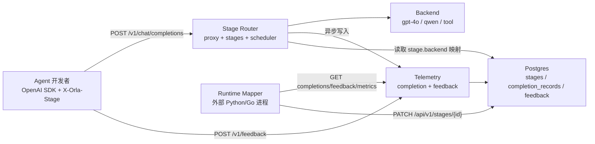

# Orla 三大组件：Stage Router、Telemetry、Runtime Mapper

本文基于 Orla v2 代码库，解释 Stage Router（阶段路由）、Telemetry（遥测）和 Runtime Mapper（运行时映射器）在架构中的职责，以及它们在 Go 代码中的具体实现路径。概念模型见 [`concepts-zh.md`](concepts-zh.md)；端到端上手见 [`quickstart-zh.md`](quickstart-zh.md)。

## 术语对照

当前 v2 代码库（[`concepts-zh.md`](concepts-zh.md) 为权威文档）**没有**直接使用 “Stage Router” 和 “Runtime Mapper” 这两个名字，但概念一一对应：

| 你提到的概念 | v2 代码/文档中的对应物 |
|---|---|
| Stage Router | Proxy 代理层 + Stages Registry + Scheduler |
| Telemetry | [`internal/telemetry/`](../internal/telemetry/) 包 |
| Runtime Mapper | 外部 Mapper 进程 + Orla 提供的 Mapper/Stage API |

README 中 v1 术语 “Stage Mapper / Workflow Orchestrator” 与 v2 模型不同；以下解读以 **v2 代码** 为准。

---

## 整体架构：运行时自适应闭环



核心思想（见 [`concepts-zh.md`](concepts-zh.md)）：

- **开发者**只给每次 LLM 调用打 `stage` 标签，不选 backend
- **平台工程师**注册 backend、设初始映射、运行 Mapper
- **Orla** 在中间执行路由、记录遥测、持久化映射

---

## 1. Stage Router（阶段路由器）

### 功能是什么

Stage Router 负责：**收到带 stage 标签的 OpenAI 兼容请求 → 查当前映射 → 把请求转发到正确的 backend 并执行**。

它不做 “根据 prompt 内容智能选模型”，映射完全由 `stages.backend` 字段决定（Mapper 可动态修改）。

### 实现路径

入口在 [`internal/api/proxy.go`](../internal/api/proxy.go) 的 `POST /v1/chat/completions`：

```go
func (h *proxyHandler) chatCompletions(w http.ResponseWriter, r *http.Request) {
    // 1. 解析 body，提取 stream 标志
    // 2. 从 X-Orla-Stage 或 metadata.orla.stage 提取 stage（必填）
    rc := extractRequestContext(r, params.Metadata)
    // 3. 查/自动创建 stage 记录
    stage, err := h.deps.Stages.GetOrCreate(r.Context(), rc.Stage)
    // 4. 解析 backend：stage.Backend 优先，否则 fallback 到 req.Model
    backendName := stage.Backend
    if backendName == "" { backendName = string(params.Model) }
    // 5. 应用 stage 级推理策略（如 reasoning_effort）
    // 6. 通过 Scheduler 获取 LLM provider 并 dispatch（流式/非流式）
}
```

三个子模块协作：

**A. Stage 注册表** — [`internal/stages/registry.go`](../internal/stages/registry.go)

- `GetOrCreate(id)`：首次见到某 stage 名时自动插入空映射行（`backend=''`）
- `Patch(id, {backend: "qwen3"})`：Mapper 更新映射，**下一次请求立即生效**
- 数据持久化在 Postgres `stages` 表，重启后 rehydrate

**B. Scheduler 调度器** — [`internal/scheduler/scheduler.go`](../internal/scheduler/scheduler.go)

- 每个 backend 一个 FCFS 执行器，用 buffered channel 限制 `max_concurrency`
- `AcquireLLM(ctx, backendName)` 获取 provider + release 函数
- 内置 circuit breaker（5 次失败 → 60s 熔断）和 rate limiter
- 流式请求也占一个 slot，直到 upstream stream 完全 drain

**C. Provider 层** — [`internal/provider/`](../internal/provider/)

- LLM backend → `provider.NewOpenAI`（OpenAI 兼容 HTTP 客户端）
- Tool backend → 如 `structurepred` 等工具 provider

路由完成后，proxy 还会：

- 计算 token 成本（`computeLLMCost`）
- 写入 Telemetry（`recordCompletion`）
- 上报 Prometheus metrics（`emitMetrics`）

Wire 协议细节见 [`proxy-zh.md`](proxy-zh.md)。

---

## 2. Telemetry（遥测）

### 功能是什么

Telemetry 是 **数据平面**：记录每次调用的完整观测数据，以及开发者提交的评分反馈。这些数据供 Runtime Mapper 做 bandit/RL 决策。

写入是 **异步批量** 的，不阻塞请求热路径；读取走 sqlc 生成的 SQL 聚合查询。

### 实现路径

包入口：[`internal/telemetry/`](../internal/telemetry/)

**写路径（Producer）**

| 数据类型 | 写入触发点 | Writer 实现 |
|---|---|---|
| Completion 记录 | proxy/tool 每次 dispatch 后 | [`CompletionWriter`](../internal/telemetry/completion.go) |
| Feedback 评分 | `POST /v1/feedback` | [`FeedbackWriter`](../internal/telemetry/feedback.go) |

两者都基于 [`internal/storage/batch_writer.go`](../internal/storage/batch_writer.go)：

- 非阻塞 `Submit()` → 缓冲 channel（CompletionWriter 默认 4096）
- 后台 goroutine 每 200ms 或满 200 条触发 flush
- 用 `pgx.CopyFrom` 批量 INSERT 到 Postgres
- 缓冲满则 drop 并计数（Prometheus 可观测）

Completion 记录字段（[`CompletionRecord`](../internal/telemetry/completion.go)）：

- `completion_id`, `stage_id`, `workflow_run`, `backend`, `status`
- `prompt_tokens`, `completion_tokens`, `latency_ms`, `cost_usd`
- `tags`（来自 `X-Orla-Tag-*` 头，如 tenant/user）
- 工具调用还有 `usage`, `tool_kind`

Feedback 字段（[`Feedback`](../internal/telemetry/feedback.go)）：

- `completion_id`, `stage_id`, `rating`（0~1）, `labels`, `notes`

**读路径（Consumer，供 Mapper 使用）**

[`internal/telemetry/reader.go`](../internal/telemetry/reader.go) 封装 sqlc 查询：

- `ListStageCompletions(stage, since, limit)` — 原始 completion 行
- `ListStageFeedback(stage, since, limit)` — 原始 feedback 行
- `StageMetrics(stage, since)` — 按 backend 聚合：count、avg/p50/p95 latency、total cost、error count

聚合 SQL 在 [`internal/storage/queries/completion_records.sql`](../internal/storage/queries/completion_records.sql) 的 `StageMetricsByBackend`。

**数据库 Schema** — [`internal/storage/migrations/0001_init.sql`](../internal/storage/migrations/0001_init.sql)：

- `completion_records` 表 + `(stage_id, created_at DESC)` 索引
- `feedback` 表 + `(stage_id, created_at DESC)` 索引

Schema 详解见 [`storage-zh.md`](storage-zh.md)。

---

## 3. Runtime Mapper（运行时映射器）

### 功能是什么

Runtime Mapper **不是 Orla 内置组件**，而是平台工程师自己写的控制循环进程（Python bandit、Thompson sampling、RL agent 等）。它的职责：

1. **读** Telemetry 数据（completions、feedback、metrics）
2. **决策** 哪个 backend 更适合某个 stage
3. **写** 更新 `stages.backend` 映射

“Runtime” 强调：映射可在服务运行中动态变更，**无需重新部署 agent 代码**。

### Orla 提供的 API 面（Mapper 侧）

**读端点** — [`internal/api/mapper.go`](../internal/api/mapper.go)：

```
GET /api/v1/stages/{id}/completions?since=&limit=
GET /api/v1/stages/{id}/feedback?since=&limit=
GET /api/v1/stages/{id}/metrics?since=
```

**写端点** — [`internal/api/stages.go`](../internal/api/stages.go)：

```
PATCH /api/v1/stages/{id}   →  { "backend": "gpt-4o-mini" }
PUT   /api/v1/stages/{id}   →  全量替换
```

典型控制循环（来自 [`concepts-zh.md`](concepts-zh.md)）：

```python
while True:
    for stage_id in stages_to_manage:
        completions = orla.get_completions(stage_id)
        feedback   = orla.get_feedback(stage_id)
        chosen     = bandit.decide(stage_id, completions, feedback)
        if chosen != orla.get_stage(stage_id).backend:
            orla.patch_stage(stage_id, backend=chosen)
    time.sleep(30)
```

### 实现细节

- Mapper API handler 只做参数解析（`since` RFC3339、`limit` 1~1000）和 JSON 序列化，业务逻辑全在外部
- Stage PATCH 用 **事务内 read-modify-write**（[`registry.go` Patch 方法](../internal/stages/registry.go)），避免并发 PATCH 丢更新
- `stages.labels` JSONB 字段可存 Mapper 自身状态（探索标志、arm 计数等），无需改 schema
- Orla **不内置** bandit 算法；[`concepts-zh.md`](concepts-zh.md) 明确列出 epsilon-greedy、Thompson sampling、contextual bandit、RL 等选项，由用户选择

### 服务启动时的组件装配

[`cmd/orla/commands/serve.go`](../cmd/orla/commands/serve.go) 把所有组件串联：

```go
api.RegisterProxyRoutes(...)       // Stage Router
api.RegisterFeedbackRoutes(...)    // Telemetry 写入口
api.RegisterMapperRoutes(...)      // Runtime Mapper 读入口
api.RegisterStageRoutes(...)       // Runtime Mapper 写入口
```

---

## 三者如何协同：一次完整请求的生命周期

1. Agent 发 `POST /v1/chat/completions`，头 `X-Orla-Stage: research`
2. **Stage Router** 查 `stages` 表 → 得到 `backend = qwen3-next-80b` → Scheduler 调度执行
3. 请求完成后 **Telemetry** 异步写入 `completion_records`（含 latency、tokens、cost）
4. Agent 发 `POST /v1/feedback`，rating=0.85 → **Telemetry** 写入 `feedback` 表
5. **Runtime Mapper** 轮询 `GET .../metrics` 和 `GET .../feedback`，发现 `gpt-4o-mini` 评分更高
6. Mapper 发 `PATCH /api/v1/stages/research {"backend":"gpt-4o-mini"}`
7. 下一次 `research` stage 的请求自动路由到新 backend（Step 2 读到的映射已更新）

---

## 关键设计约束（读代码时值得注意）

- Orla **不是** model gateway：不会按 prompt 内容、成本阈值自动选模型
- Orla **不是** retry/fallback chain：backend 失败即失败，fallback 策略属于 Mapper 职责
- Stage 与 Backend 严格分离：开发者管 stage 语义，平台工程师管映射
- 控制平面（stages/backends CRUD）同步写；数据平面（telemetry）异步批量写
- v1 README 提到的 “Memory Manager / KV cache” 在 **当前 v2 代码中不存在**

## 延伸阅读

- [`concepts-zh.md`](concepts-zh.md) — 概念模型与角色分工
- [`proxy-zh.md`](proxy-zh.md) — Stage Router 的 wire 协议
- [`storage-zh.md`](storage-zh.md) — Telemetry 持久化 schema
- [`quickstart-zh.md`](quickstart-zh.md) — 端到端上手
